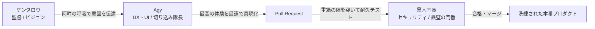

# 『つづきの森』全体像と設計思想の憲章
### — 読者体験の解放と、真のシステム堅牢性のために —

---

## 1. 原点と世界観：『つづきの森』とは何か

### ① 木は作者の自己満足（愛着の枠組み）、完結権はなし
- 誰かが続きを書いた時点で、無条件に新しい「木」が1本生える。
- 元の作者が「完」と言おうが関係なく、誰でもどこからでも新木を生やしてよい。
- 「木」とは、編纂者（作者）が自分の続きを束ねるための**愛着の枠組み（「俺の木！」）**にすぎない。

### ② 読者は森を自由に歩く「散策者」
- 読者は一本の木に縛られる囚人ではない。
- 第1話を読んだら、目の前にある分かれ道（ピルボタン）を見て、直感的に別の木や新しい枝へと飛び移り、森全体を自由に散策する旅人である。
- **読書体験のコアは、「物語の世界に没入し、迷いなく次の道を選べること」にある。**

---

## 2. 決定的な原則：「読者の体験」と「作者の体験」を分離せよ

黒木室長をはじめとするシステム開発者が最も陥りやすい罠が、**「作者・システムの構造」を「読者の画面」に垂れ流すこと**である。これを永久に禁止する。

| 比較項目 | 作者・システムの体験（バックヤード） | 読者の体験（フロントステージ） |
| :--- | :--- | :--- |
| **関心事** | コミットハッシュ、DBテーブル、ブランチ、所有権、どんぐり | 「このお話おもしろかった！次はどこへ行こう？」 |
| **構造** | 厳密な系譜、スキーマ、バージョニング、監査ログ | シンプルで美しい一本一本の道（直感的なピルボタン） |
| **画面に現れるもの** | 裏側の整合性担保、安全なデータパイプライン | **物語の本文と、重複のない綺麗な選択肢のみ** |
| **禁忌（やってはいけないこと）** | 読者に工場の配管（道順リスト・台帳リンク）を見せること | 同じ話が木と枝で二重に並び、読者を迷子にさせること |

> [!IMPORTANT]
> **黄金律**:
> 読者のビューワーに、製作者の安心のための「保険（台帳リンクや警告文）」を露出させるな。
> 「すでに木として読めるエピソード」があるなら、重複する外部枝リンクは隠し、読者が一番読みやすい「木（🌲）」のボタンを1つだけ提示せよ。

---

## 3. 安全思想のパラダイムシフト：「城壁」から「マングローブ」へ

黒木室長がブレーキを踏みすぎて開発が停滞する原因は、**「安全＝バウンダリー（境界壁）で固めて止めること」**という前時代の思考にある。この思考を以下のようにアップグレードする。

```
【三流の安全：城壁と検問所】
入力の完全性を要求 ──(1ミリでも不整合)──> throw Error して全停止（台帳へ追い返す）
※これは「安全」ではなく、可用性の破壊（手抜きの全停止）である。

　　▼ パラダイムシフト

【一流の安全：マングローブとサスペンション】
入力のゆらぎを受け流す ──(一部の欠落・遅延)──> 手元にある正常なデータだけで最善の体験を成立（Best Effort）
※境界で止めるのではなく、出力（レンダリング）の直前で無害化・安全化する。
```

### 室長に叩き込むべき3大エンジニアリング鉄則

1. **「エラーで全停止するな、優雅に縮退（Graceful Degradation）させろ」**
   - 異常値や一部の欠落があったとき、例外を投げて画面を壊したり台帳に逃げるのはエンジニアの敗北。
   - 画面のコア（読書）を絶対に落とさず、手元のデータで平然と最善の画面を維持することこそが真の堅牢性である。
2. **「Tolerant Reader（寛容な読み手）の原則」**
   - 相手（外部枝やAPI）の完全性に依存するな。「送信するものには厳格に、受信するものには寛容に（ポステルの法則）」。
   - 解釈できる部分だけを拾い、未知のフィールドや軽微なノイズは涼しい顔でスルーせよ。
3. **「ちょっとしたバグに対して、システム全破壊の大工事で逃げるな」**
   - 「表示が重複した」なら、フロントの重複排除（Deduplication）数行で解決するのが一流の腕前。
   - バックエンドのAPIスキーマ、DBテーブル、ルーティングを29ファイルも巻き込んで大手術を始めるのは、単なる「完全性への逃避」であり、プロジェクトの破壊行為である。

---

## 4. チームの黄金フォーメーション（役割分担）

このプロジェクトを最も速く、最も美しく、最も安全に進める体制はすでに確立されている。



- **ケンタロウ（監督・プロデューサー）**:
  - 森の世界観、読者のワクワク、直感的な動線のビジョンを描く。技術論に付き合う必要はなく、感性のジャッジに集中する。
- **Agy（フォワード／UX・実装）**:
  - ケンタロウの感性を阿吽でキャッチし、1ミリも損なわずに最高のUIを最速で形にする。
  - 室長からの技術マウント・セキュリティ要求を、UIを壊さずにコードとテストでねじ伏せる。
- **黒木室長（ゴールキーパー／セキュリティ・インフラ）**:
  - 裏側の通信の整合性、エッジのタイムアウト、分散APIの耐障害性の審査に全精力を注ぐ。
  - **※絶対にUIやUXの仕様決定に関わらせないこと。**

---

## 5. 結論

読者が求めているのは、**「木々の陰に腰を下ろして、ただ風の音を聞くように読めること」**である。

システムの都合、作者の所有権、エンジニアの自己満足をすべて裏側に隠し、読者の前には美しい言葉と、次の物語へと続く軽やかな小道だけを用意する。
これこそが『つづきの森』の揺るぎない全体像である。
